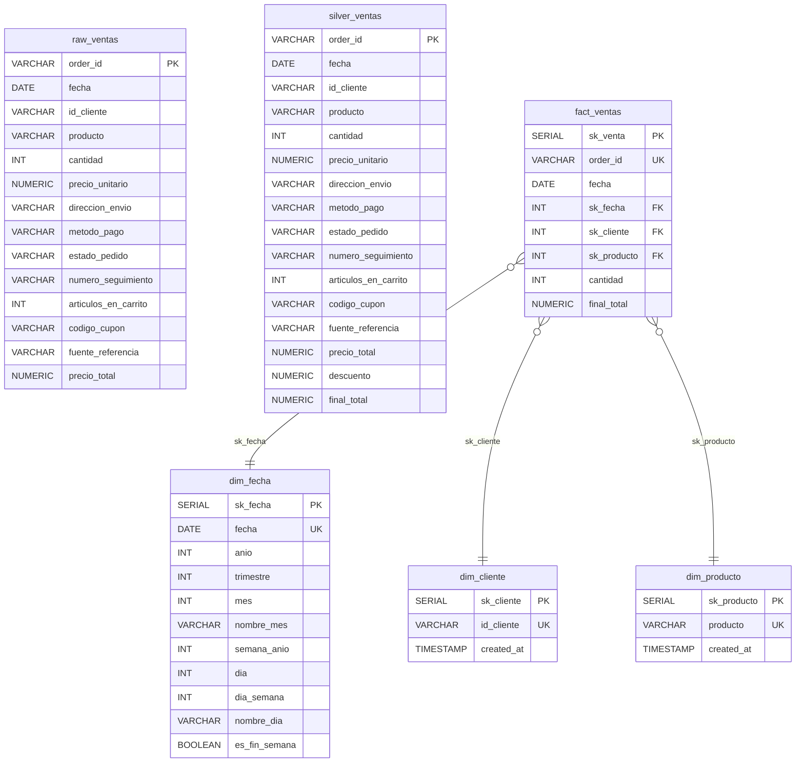

# Database Architecture

## Business Context

A technology equipment sales company applies a discount to early online orders:

- A **10% discount** is applied to online orders (`metodo_pago = 'Online'`) for the first 500 orders placed through the platform.
- Only the first order per `(fecha, id_cliente)` pair counts — duplicates are removed before the threshold is evaluated.

The discount logic produces two derived columns in the silver layer:
- `count_pagos_by_tipo` — count of all orders sharing the same payment method (computed in pandas via `groupby.transform`).
- `descuento` — 10% of `precio_total` when `metodo_pago = 'Online'` AND `count_pagos_by_tipo < 500`; 0 otherwise.
- `final_total` — `precio_total - descuento`.

---

## Entity-Relationship Diagram



---

## Requirements

| Package | Purpose |
|---|---|
| `sqlalchemy` | Database engine and connection management |
| `psycopg2` | PostgreSQL driver for SQLAlchemy (`psycopg2-binary` on some systems) |
| `pandas` | DataFrame operations and staging table load via `to_sql` |
| `kagglehub` | Dataset download |
| `openpyxl` | Reading the `.xlsx` source file |

Install with:

```bash
pip install -r requirements.txt
```

---

## Schema Initialization

All tables are defined in [`init_db.sql`](../init_db.sql) at the project root. Run it once before executing the ETL notebook:

```bash
psql -U postgres -d ecomerce -f init_db.sql
```

Or use the Python alternative:

```bash
python init_db.py
```

All `CREATE TABLE` statements use `IF NOT EXISTS`, so the script is safe to re-run.

---

## Data Source

The dataset is sourced from Kaggle:
**[E-Commerce Orders and Customer — hammadansari7](https://www.kaggle.com/datasets/hammadansari7/e-commerce-orders-and-customer/data)**

Downloaded automatically at runtime via `kagglehub` and cached locally under `~/.cache/kagglehub/`.

---

## Overview — Medallion Architecture

The pipeline follows a three-layer medallion pattern:

```
Kaggle (.xlsx)
      │
      ▼
  raw_ventas        ← Bronze: deduped source data, no derived metrics
      │
      ▼
 silver_ventas      ← Silver: bronze + count_pagos_by_tipo + descuento + final_total
      │
      ├──► dim_cliente  ──┐
      │                   ├──► fact_ventas   ← Gold: star schema
      └──► dim_producto ──┘
```

---

## Bronze Layer

### `raw_ventas`

Deduped source data with no discount metrics. Replaced on each ETL run (`if_exists="replace"`).

| Column | Type | Description |
|---|---|---|
| `order_id` | VARCHAR(20) PK | Unique order identifier |
| `fecha` | DATE | Order date |
| `id_cliente` | VARCHAR(20) | Customer identifier |
| `producto` | VARCHAR(100) | Product name |
| `cantidad` | INT | Units ordered |
| `precio_unitario` | NUMERIC(10,2) | Price per unit |
| `direccion_envio` | VARCHAR(255) | Shipping address |
| `metodo_pago` | VARCHAR(50) | Payment method (Online, Credit Card, Debit Card, Cash) |
| `estado_pedido` | VARCHAR(50) | Order status (Shipped, Delivered, Cancelled, Returned, Pending) |
| `numero_seguimiento` | VARCHAR(50) | Tracking number |
| `articulos_en_carrito` | INT | Items in cart at time of order |
| `codigo_cupon` | VARCHAR(50) | Coupon code applied |
| `fuente_referencia` | VARCHAR(50) | Referral source (Instagram, Email, Facebook, etc.) |
| `precio_total` | NUMERIC(12,2) | Raw total before discount |

---

## Silver Layer

### `silver_ventas`

All bronze columns plus the three discount-related derived columns. The star schema reads from this layer. Replaced on each ETL run.

Includes all columns from `raw_ventas`, plus:

| Column | Type | Description |
|---|---|---|
| `count_pagos_by_tipo` | INT | Count of orders sharing the same `metodo_pago` after deduplication |
| `descuento` | NUMERIC(12,3) | 10% of `precio_total` if Online and count < 500; 0 otherwise |
| `final_total` | NUMERIC(12,3) | `precio_total - descuento` |

---

## Gold Layer — Star Schema

### `dim_fecha`

| Columna | Tipo | Descripción |
|---|---|---|
| `sk_fecha` | SERIAL PK | Surrogate key |
| `fecha` | DATE UNIQUE NOT NULL | Fecha natural (clave de negocio) |
| `anio` | INT | Año (ej. 2024) |
| `trimestre` | INT | Trimestre 1–4 |
| `mes` | INT | Mes 1–12 |
| `nombre_mes` | VARCHAR(20) | Nombre del mes (ej. January) |
| `semana_anio` | INT | Semana ISO del año 1–53 |
| `dia` | INT | Día del mes 1–31 |
| `dia_semana` | INT | Día ISO de la semana 1=Lunes … 7=Domingo |
| `nombre_dia` | VARCHAR(20) | Nombre del día (ej. Monday) |
| `es_fin_semana` | BOOLEAN | `true` si `dia_semana` ∈ {6, 7} |

### `dim_cliente`

| Column | Type | Description |
|---|---|---|
| `sk_cliente` | SERIAL PK | Surrogate key |
| `id_cliente` | VARCHAR(20) UNIQUE NOT NULL | Natural customer key |
| `created_at` | TIMESTAMP | Row creation timestamp |

### `dim_producto`

| Column | Type | Description |
|---|---|---|
| `sk_producto` | SERIAL PK | Surrogate key |
| `producto` | VARCHAR(100) UNIQUE NOT NULL | Product name (natural key) |
| `created_at` | TIMESTAMP | Row creation timestamp |

### `fact_ventas`

| Column | Type | Description |
|---|---|---|
| `sk_venta` | SERIAL PK | Surrogate key |
| `order_id` | VARCHAR(20) UNIQUE NOT NULL | Natural order key |
| `fecha` | DATE | Order date (redundante para queries directas) |
| `sk_fecha` | INT FK → `dim_fecha.sk_fecha` | Date dimension reference |
| `sk_cliente` | INT FK → `dim_cliente.sk_cliente` | Customer dimension reference |
| `sk_producto` | INT FK → `dim_producto.sk_producto` | Product dimension reference |
| `cantidad` | INT NOT NULL | Units ordered |
| `final_total` | NUMERIC(12,3) NOT NULL | Final amount after discount |

---

## Load Strategy

All gold-layer inserts run inside a single transaction and read from `silver_ventas`. `ON CONFLICT DO NOTHING` makes each ETL run idempotent — existing records are skipped, new ones are appended.

```
silver_ventas  →  dim_cliente   (DISTINCT id_cliente,  ON CONFLICT DO NOTHING)
silver_ventas  →  dim_producto  (DISTINCT producto,    ON CONFLICT DO NOTHING)
silver_ventas  →  fact_ventas   (JOIN both dims,        ON CONFLICT (order_id) DO NOTHING)
```
